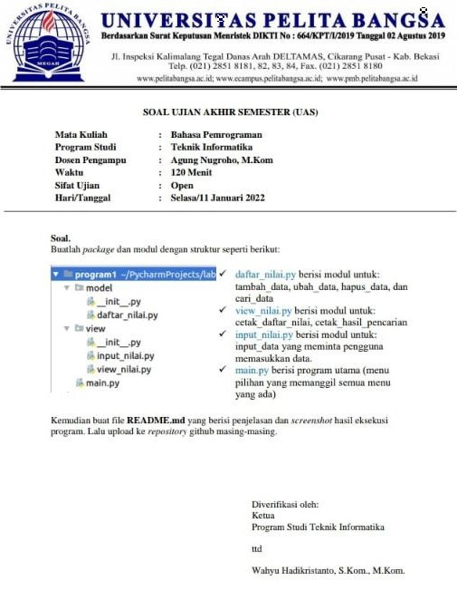

# **UAS SEMESTER 1**
> NAMA  = NUR HIDAYAT
> KELAS = TI 21 C5
> NIM   = 312110584

## SOAL

## PENJELASAN PROGRAM
> main.py

berisi menu utama untuk memanggil semua program 

> model

>> daftar_nilai.py

pada daftar nilai berisi program untuk memanggil inputan dari package **view** folder **input_nilai**
yang terdiri dari :

1. menambah data
2. mengubah data
3. menghapus data
4. mencari data
5. menampilkan semua data

> view

>> input_nilai.py

berisi inputan inputan dari **keyboard** yang akan di teruskan ke **daftar_nilai.py** 

>> view_nilai.py

berisi terusan pemanggilan **tampikan semua data** dan **mencari data** dari **daftar_nilai.py** yang diteruskan ke **main.py**

## __init__.py
**__init__.py** adalah file yang berfungsi untuk inisialisasi agar program dapat mengimport program lain .

## tampilan pada editor text

## hasil program

*untuk lebih jelas melihat hasil program silahkan download program lalu jalankan program*

terimakasih
